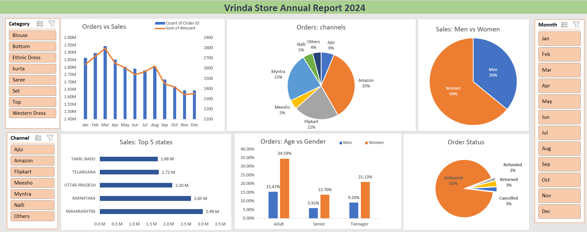

# 📊 Vrinda Store Data Analysis 2024

## Overview

This project presents an interactive sales dashboard built in **Microsoft Excel** to analyze Vrinda Store's 2024 sales data. The dataset was cleaned and prepared before creating Pivot Tables, Pivot Charts, and Slicers to identify sales trends, customer behavior, and business performance.

The dashboard enables users to explore the data interactively through filters and gain insights that can support business decision-making.

---

## Business Questions

This dashboard answers the following questions:

* Compare Sales and Orders using a single chart.
* Which month recorded the highest Sales and Orders?
* Who purchased more in 2024—Men or Women?
* What were the different Order Statuses?
* Which are the Top 5 States contributing to Sales?
* What is the relationship between Age Group and Gender based on Orders?
* Which Sales Channel contributes the most sales?
* Which Product Category is the highest selling?

---

## Data Preparation

Before building the dashboard, the dataset was prepared by:

* Cleaning and formatting the data
* Checking for missing and inconsistent values
* Replacing repeated values where necessary
* Creating an **Age Group** column from the Age column
* Creating a **Month** column from the Date column

---

## Dashboard Features

* Interactive Excel Dashboard
* Pivot Tables
* Pivot Charts
* Slicers for:

  * Month
  * Category
  * Channel

---

## Key Insights

* Women account for approximately **65%** of total purchases.
* Customers aged **30–49 years** contribute nearly **50%** of all orders.
* **Maharashtra**, **Karnataka**, and **Uttar Pradesh** are the top-performing states by sales.
* **Amazon**, **Flipkart**, and **Myntra** generate the highest sales among all channels.

---

## Recommendations

Based on the analysis, Vrinda Store can improve its business performance by:

* Focusing marketing campaigns and loyalty programs on women customers, who contribute the highest share of purchases.
* Targeting the 30–49 age group with personalized promotions and product recommendations.
* Strengthening operations and promotional efforts in Maharashtra, Karnataka, and Uttar Pradesh while identifying opportunities to grow sales in other regions.
* Expanding partnerships and promotional campaigns on Amazon, Flipkart, and Myntra to maximize online sales.
* Ensuring adequate inventory and marketing support for high-performing product categories.
* Monitoring order statuses regularly to reduce cancellations and improve customer satisfaction.

---

## Tools Used

* Microsoft Excel
* Pivot Tables
* Pivot Charts
* Slicers
* Dashboard Design

---

## Dashboard Preview

## Project Files

* **Vrinda_Store_Data_Analysis_2024.xlsx** – Complete workbook containing the dataset, Pivot Tables, and interactive dashboard.
* **Dashboard.png** – Dashboard preview.
* **README.md** – Project documentation.

---

## Conclusion

This project demonstrates how Microsoft Excel can be used to clean data, build interactive dashboards, and generate meaningful business insights. It highlights practical Excel skills commonly used in data analysis and business reporting.
